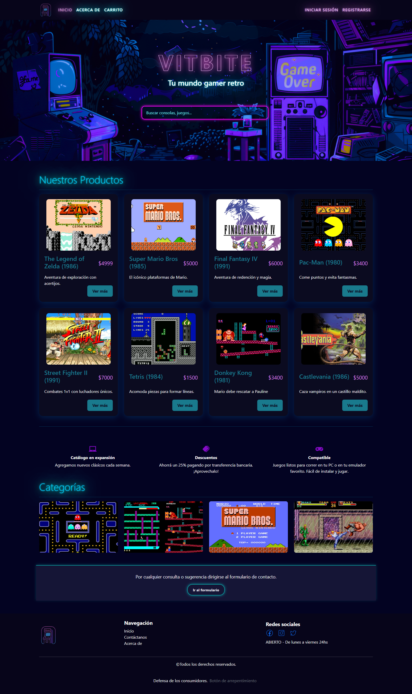

# 🎮 Ecommerce Gamer - React

Este es un proyecto de ecommerce para videojuegos construido con **React**. Incluye funciones como listado de productos, carrito de compras, y gestión de productos utilizando una **API local con JSON Server**.

---

## 🚀 Tecnologías usadas

- ⚛️ React (Vite)
- 💅 CSS + Bootstrap (opcional)
- 🔄 JSON Server (simulación de API REST)
- 💡 SweetAlert2 (para notificaciones)

---

## 📸 Vista previa



---

## ✅ Requisitos previos

Asegúrate de tener instalados:

- [Node.js](https://nodejs.org/) (v14 o superior)
- [npm](https://www.npmjs.com/)
- `json-server` (puede instalarse global o localmente)

---

## 📦 Instalación

1. Clona el repositorio:

```bash
git clone https://github.com/AcostaCl/Ecommerce-Gamer-React.git
cd Ecommerce-Gamer-React
```

2. Instala las dependencias del proyecto:

```bash
npm install
```

3. Instala JSON Server si no lo tienes:

```bash
npm install -g json-server
```

4. En una terminal separada, ejecuta la app de React:

```bash
json-server --watch db.json --port 3000
```

5. En una terminal separada, ejecuta la app de React:

```bash
npm run dev
```

Esto abrirá tu proyecto en:
http://localhost:5173

## 📁 Estructura del proyecto

```txt
Ecommerce-Gamer-React/
├── public/
├── src/
│   ├── components/ componentes reutilizables
│   ├── pages/ componentes principales
│   ├── helpers/ funciones para las solicitudes a json-server
│   ├── App.jsx configuración principal de rutas
│   ├── main.jsx punto de entrada
├── db.json ← Base de datos falsa para JSON Server
├── package.json
```

## 📋 Scripts útiles

| Comando                                   | Accion                             |
| :---------------------------------------- | :--------------------------------- |
| `npm run dev	`                             | Levanta el frontend (React + Vite) |
| `json-server --watch db.json --port 3000		` | Levanta la API REST local          |

## 🧠 Notas

- Asegúrate de que JSON Server esté corriendo en el puerto 3000.
- La app espera que los productos estén disponibles en /productos dentro del db.json.
- Puedes modificar db.json para agregar más productos de prueba fácilmente.

## 💻 Autor

Cl Acosta
Repositorio: github.com/AcostaCl/Ecommerce-Gamer-React

## 📄 Licencia

Este proyecto está bajo la licencia MIT.
